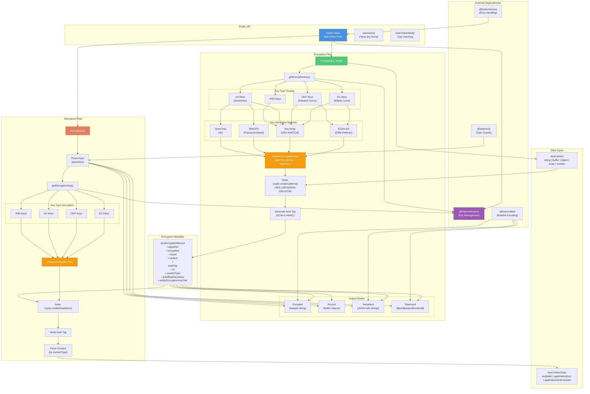

# Mermaid Diagram

```mermaid

  graph TB
      subgraph "External Dependencies"
          KRYPTOS["@lindorm/kryptos<br/>(Key Management)"]
          B64["@lindorm/b64<br/>(Base64 Encoding)"]
          IS["@lindorm/is<br/>(Type Guards)"]
          ERRORS["@lindorm/errors<br/>(Error Handling)"]
      end

      subgraph "Public API"
          AESKIT["AesKit Class<br/>Main Entry Point"]
          PARSE["parseAes()<br/>Parse any format"]
          ISAES["isAesTokenised()<br/>Type checking"]
      end

      subgraph "Encryption Flow"
          ENCRYPT["encrypt(data, mode)"]
          GET_ENC_KEY["getEncryptionKey()"]

          subgraph "Key Type Routing"
              EC_ENC["EC Keys<br/>(Elliptic Curve)"]
              OKP_ENC["OKP Keys<br/>(Edwards Curve)"]
              OCT_ENC["oct Keys<br/>(Symmetric)"]
              RSA_ENC["RSA Keys"]
          end

          subgraph "Key Derivation Methods"
              DIR["Direct Key<br/>(dir)"]
              ECDH["ECDH-ES<br/>(Diffie-Hellman)"]
              KEYWRAP["Key Wrap<br/>(AES-KW/GCM)"]
              PBKDF["PBKDF2<br/>(Password-based)"]
          end

          CEK["Content Encryption Key<br/>(Split into encKey + hashKey)"]
          AES_CIPHER["Node crypto.createCipheriv()<br/>(AES-128/192/256-CBC/GCM)"]
          AUTH_TAG["Generate Auth Tag<br/>(GCM or HMAC)"]

          subgraph "Output Modes"
              ENCODED["Encoded<br/>(base64 string)"]
              RECORD["Record<br/>(Buffer objects)"]
              SERIALISED["Serialised<br/>(JSON-safe strings)"]
              TOKENISED["Tokenised<br/>($enc$params$content$)"]
          end
      end

      subgraph "Decryption Flow"
          DECRYPT["decrypt(data)"]
          PARSE_INPUT["Parse Input<br/>(parseAes)"]
          GET_DEC_KEY["getDecryptionKey()"]

          subgraph "Key Type Decryption"
              EC_DEC["EC Keys"]
              OKP_DEC["OKP Keys"]
              OCT_DEC["oct Keys"]
              RSA_DEC["RSA Keys"]
          end

          CEK_DEC["Content Encryption Key"]
          AES_DECIPHER["Node crypto.createDecipheriv()"]
          VERIFY_TAG["Verify Auth Tag"]
          PARSE_CONTENT["Parse Content<br/>(by contentType)"]
      end

      subgraph "Data Types"
          CONTENT["AesContent<br/>string | Buffer | object | array | number"]
          CONTENT_TYPE["AesContentType<br/>text/plain | application/json | application/octet-stream"]
      end

      subgraph "Encryption Metadata"
          RECORD_TYPE["AesEncryptionRecord<br/>• algorithm<br/>• encryption<br/>• keyId<br/>• content<br/>•
  authTag<br/>• IV<br/>• contentType<br/>• pbkdfSalt/Iterations<br/>• publicEncryptionKey/Jwk"]
      end

      %% Main flow connections
      AESKIT --> ENCRYPT
      AESKIT --> DECRYPT
      AESKIT --> KRYPTOS

      ENCRYPT --> CONTENT
      ENCRYPT --> GET_ENC_KEY
      GET_ENC_KEY --> KRYPTOS

      GET_ENC_KEY --> EC_ENC
      GET_ENC_KEY --> OKP_ENC
      GET_ENC_KEY --> OCT_ENC
      GET_ENC_KEY --> RSA_ENC

      EC_ENC --> ECDH
      EC_ENC --> KEYWRAP
      OKP_ENC --> ECDH
      OKP_ENC --> KEYWRAP
      OCT_ENC --> DIR
      OCT_ENC --> KEYWRAP
      OCT_ENC --> PBKDF
      RSA_ENC --> KEYWRAP

      ECDH --> CEK
      KEYWRAP --> CEK
      PBKDF --> CEK
      DIR --> CEK

      CEK --> AES_CIPHER
      CONTENT --> AES_CIPHER
      AES_CIPHER --> AUTH_TAG

      AUTH_TAG --> RECORD_TYPE

      RECORD_TYPE --> ENCODED
      RECORD_TYPE --> RECORD
      RECORD_TYPE --> SERIALISED
      RECORD_TYPE --> TOKENISED

      %% Decryption flow
      DECRYPT --> PARSE_INPUT
      PARSE_INPUT --> ENCODED
      PARSE_INPUT --> RECORD
      PARSE_INPUT --> SERIALISED
      PARSE_INPUT --> TOKENISED

      PARSE_INPUT --> GET_DEC_KEY
      GET_DEC_KEY --> KRYPTOS

      GET_DEC_KEY --> EC_DEC
      GET_DEC_KEY --> OKP_DEC
      GET_DEC_KEY --> OCT_DEC
      GET_DEC_KEY --> RSA_DEC

      EC_DEC --> CEK_DEC
      OKP_DEC --> CEK_DEC
      OCT_DEC --> CEK_DEC
      RSA_DEC --> CEK_DEC

      CEK_DEC --> AES_DECIPHER
      RECORD_TYPE --> AES_DECIPHER
      AES_DECIPHER --> VERIFY_TAG
      VERIFY_TAG --> PARSE_CONTENT
      PARSE_CONTENT --> CONTENT_TYPE

      %% Utility connections
      B64 --> ENCODED
      B64 --> TOKENISED
      B64 --> SERIALISED
      IS --> PARSE_INPUT
      ERRORS --> AESKIT

      style AESKIT fill:#4a90e2,stroke:#2e5c8a,color:#fff
      style ENCRYPT fill:#50c878,stroke:#2d7a4a,color:#fff
      style DECRYPT fill:#e27d60,stroke:#a85a43,color:#fff
      style KRYPTOS fill:#9b59b6,stroke:#6c3a8a,color:#fff
      style CEK fill:#f39c12,stroke:#b87a0a,color:#fff
      style CEK_DEC fill:#f39c12,stroke:#b87a0a,color:#fff
```
